# Ebyte E32

## Basic tree summary
```bash
├───DUE_E32_UART_BRIDGE - Arduino DUE example to talk between modules of the same configuration.
├───DUE_E32_UART_BRIDGE_CONFIG - Arduino DUE example to program arduino as serial (UART) bridge between RF_Setting_v3.49.exe program and PC to config the module.
├───E32-433T30D_Usermanual_EN_v1.9.pdf - User Manual
├───EXPERIMENT_power_consumption_dBm - Data resulting from different experiments see the power consumption of the module that depends on the configuration of 4 options {21, 24, 27, 30} dBm.
├───EXPERIMENT_RTT_Delay_Drops
├───SIMULINK_DUE_UART_TALK_ - Simulink example to program Arduino DUE to test the modules and see the power consumption.
│   └───Wattmeter_INA219_Driver - Driver of the wattmeter module INA219 to measure the power consumption (add all files to the path).
└───无线串口配置软件_v3.49
    └───RF_Setting_v3.49.exe - Program delivered by official vendor which allow to config the module
```

## Another information

- Recommend using a smartphone power adaptor or power supply of 5V with enough intensity necessary to transmit around 500-600 mAh, see User Manual for more information.

- Caution, the maximum packet size in a single send is 58 bytes, see User Manual for more information.  

- For a loopback test, you could power supply a properly configured module, ground M0, M1 and loop RX and TX of the module, only valid for transparent transmission, see User Manual for more information.

- The working modes are clearly explained in the reference link at below (Mischianti - Ebyte E32), see User Manual for more information.

- You have the links below to see (Mischianti - Ebyte E32) that explains a lot of information and features of the modules. We use the module as simply as possible to be to betable programming the radio serial odule. Still, it is possible to make better or more deep power efficient programs, see User Manual for more information.

## Links
- [Mischianti - Ebyte E32](https://www.mischianti.org/2019/10/15/lora-e32-device-for-arduino-esp32-or-esp8266-specs-and-basic-usage-part-1/)
- [Wikipedia - LoRa](https://en.wikipedia.org/wiki/LoRa)

## Schematic


## Connection Example

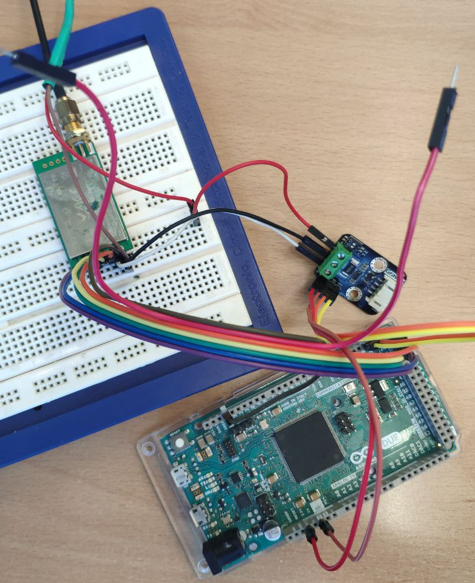

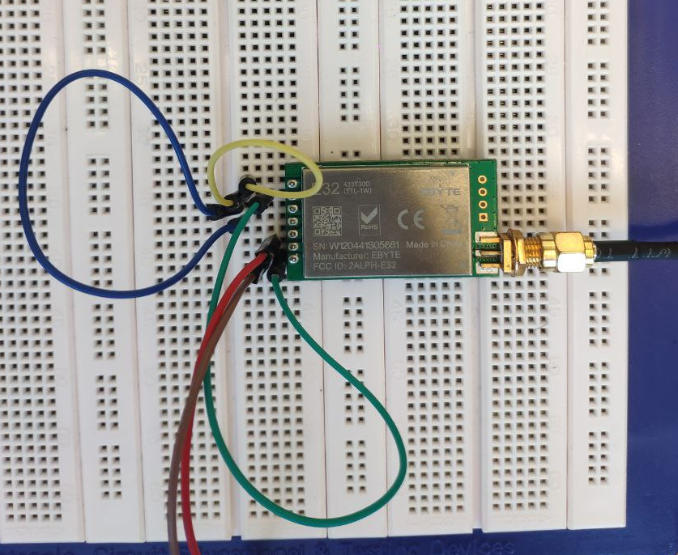

## Previous analysis

### Velocity transmission of the radio link
| Kilo bits per second 	| bits per second<br>(multiply by 1000)<br>1K = 1000 	| Bytes<br>(divide by 8)<br>8 bits = 1 Byte 	| Packets per second<br>(58 B per packet) 	|
|----------------------	|----------------------------------------------------	|-------------------------------------------	|-----------------------------------------	|
| 0.3 Kbps             	| 300 bps                                            	| 37.5 Bps                                  	| 0.646 paq/s                             	|
| 1.2 Kbps             	| 1200 bps                                           	| 150 Bps                                   	| 2.585 paq/s                             	|
| 2.4 Kbps             	| 2400 bps                                           	| 300 Bps                                   	| 5.172 paq/s                             	|
| 4.8 Kbps             	| 4800 bps                                           	| 600 Bps                                   	| 10.34 paq/s                             	|
| 9.6 Kbps             	| 9600 bps                                           	| 1200 Bps                                  	| 20.68 paq/s                             	|
| 19.2 Kbps            	| 19200 bps                                          	| 2400 Bps                                  	| 41.37 paq/s                             	|

The current configuration 19.2 Kbps - Half duplex, the serial module to send and receive have the same address and channel. The number of result packets could be divided between nodes on the infrastructure.

## Instant power consumption vs gain selected

As we can see in the figure, we have 4 transmission power options, these different options directly affect the transmission gain.

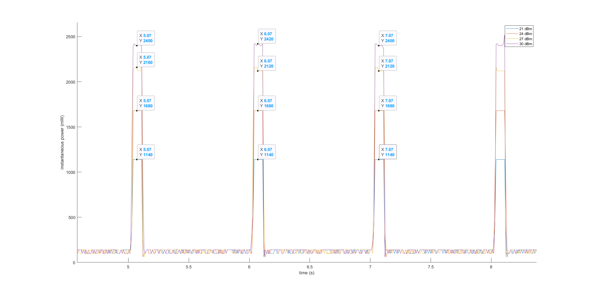

## Transmission time (instant power) vs packet size and energy consumption

This experiment assumes that the transmission time is proportional to the instantaneous consumption pulse width. The investigation evaluates packet sizes of (1, 2, 4, 8, 16, 24, 32, 48) bytes. There are also experiments with 64 bytes packet size; in this experiment, the sender module emits two separate pulses of the transmission that don't return anything, so there is an error in the transmission (collision, error in the loopback of the other module, etc.).

In these figures separated in two for clarity, it may seem that all transmissions consume and take the same time to send, let's see a figure in depth.

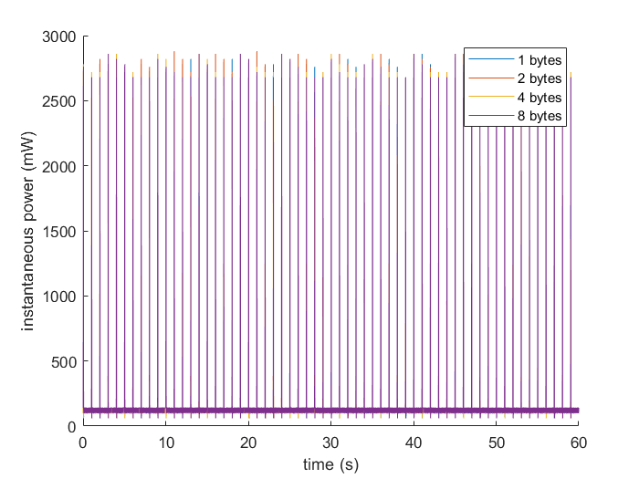
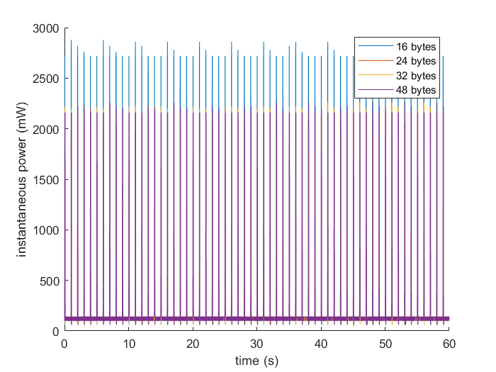

In these figures we can see that each different packet size consumes, the most significant thing is the pulse width. As can be seen, as the packet size increases, the pulse width in power consumption increases.

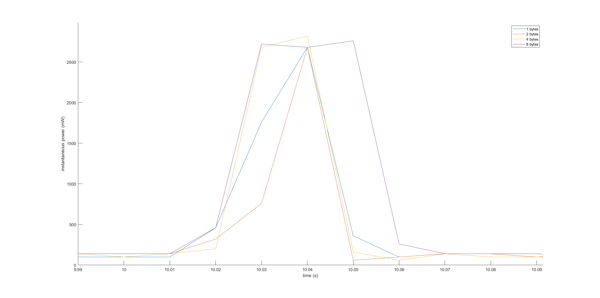
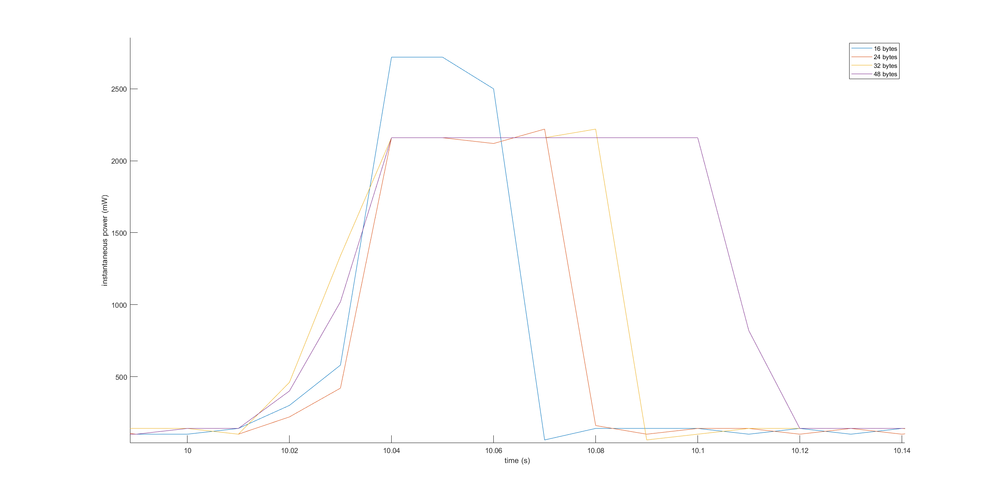

| Packet size<br>(bytes) 	| Pulse width<br>(seg) 	|
|:----------------------:	|:--------------------:	|
|            1           	|         0.02         	|
|            2           	|         0.02         	|
|            4           	|         0.03         	|
|            8           	|         0.04         	|
|           16           	|         0.04         	|
|           24           	|         0.05         	|
|           32           	|         0.06         	|
|           48           	|         0.08         	|

In the absence of a higher resolution, the result would be this as we can see a linear approximation to the size of the packet up to 58 bytes would be enough.

Now, when exceeding 64 bytes, we have to send it in two different packets, generating two pulses, and therefore, two sendings.

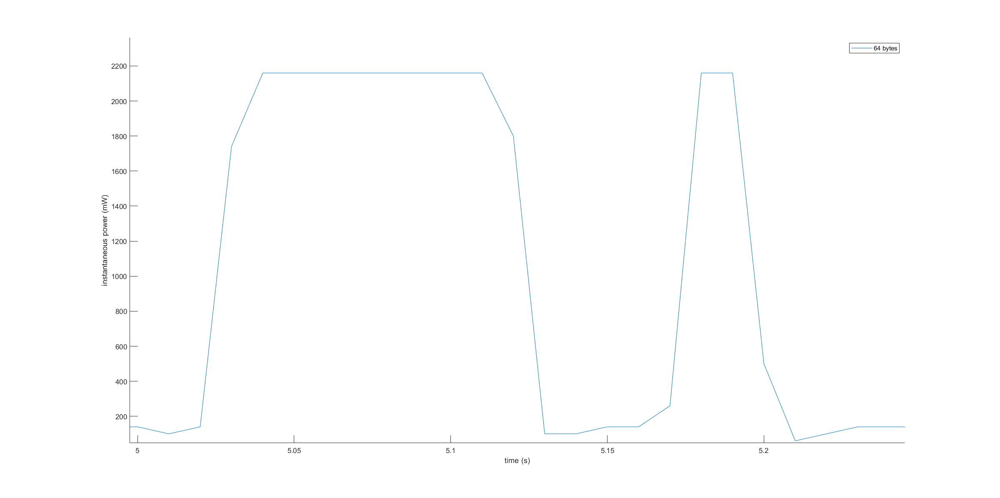

In addition, we can see a quasi-linear relationship between energy consumption and packet size.

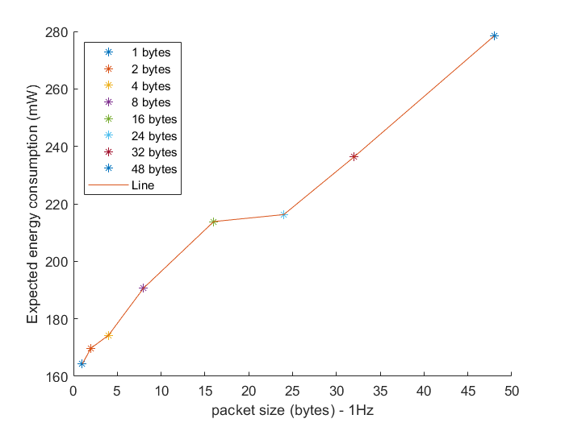
(*) Extrapolated experiment one hour data.


### Round time trip and dropout probability

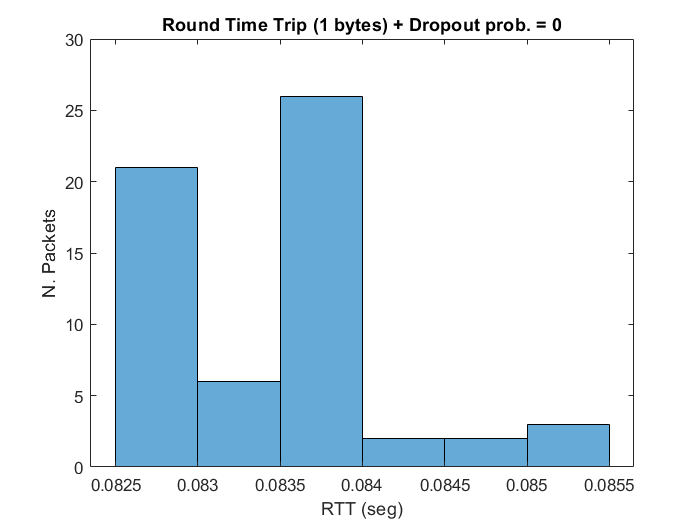
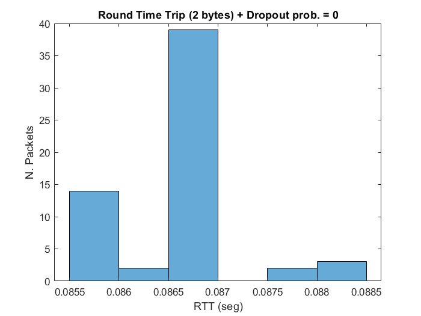
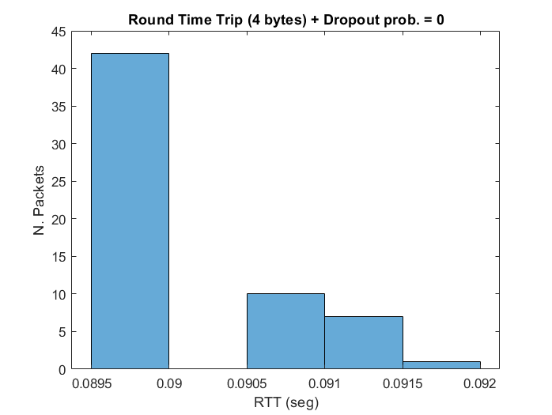
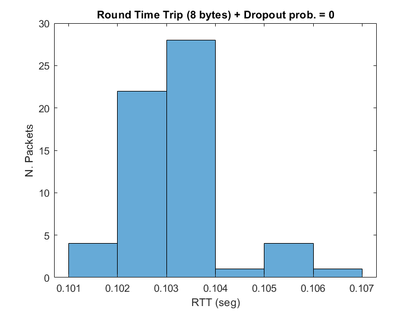

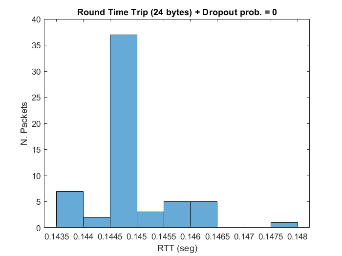
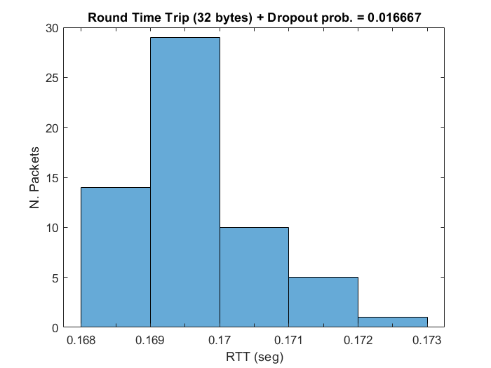
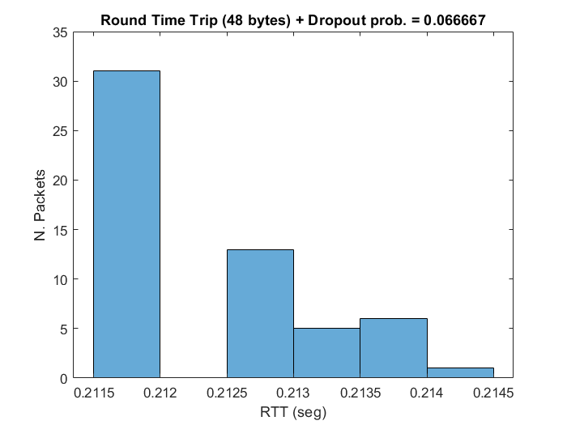

## More experiments - long test of 15 minuts at 5Hz packets

### Round time trip and dropout probability

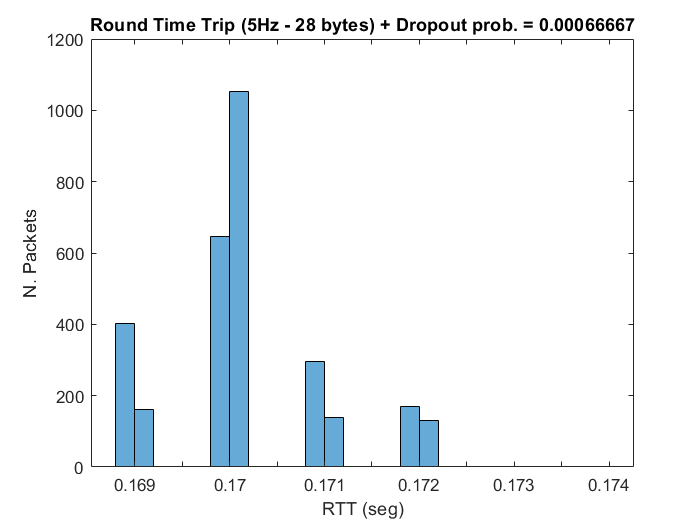

Extrapolated experiment one hour data.

Expected intensity consumption 108.89 mA.

Expected power consumption 544.48 mW.

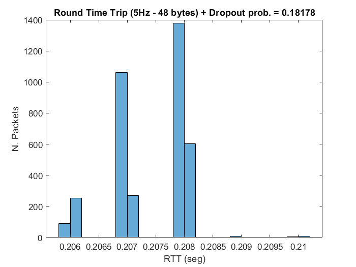

Extrapolated experiment one hour data.

Expected intensity consumption 213.63 mA.

Expected power consumption 1068.2 mW.

The number of collisions (hypothesis) grows up because the RTT and period it's near, 0.2s period and RTT 0.208s.

## Future experiment

- Send and receive at different channels and address. (Fixed transmission modality of the modules, avoiding packet collisions, improve transmission interval, etc)